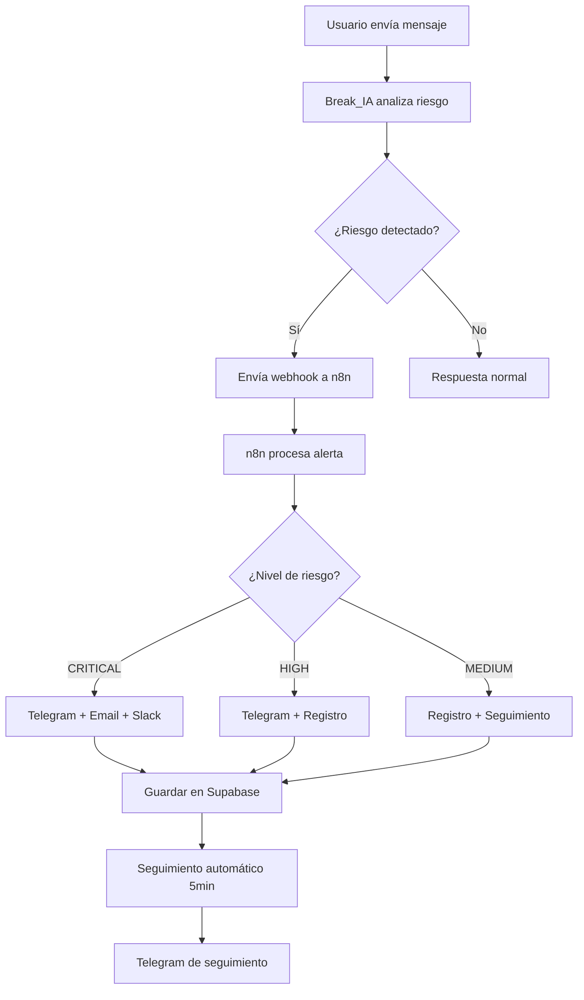

# Break_IA - Configuración n8n + Telegram

## 📋 Configuración del Sistema de Alertas

### 🔧 Variables de Entorno para n8n

```bash
# Bot de Telegram
TELEGRAM_BOT_TOKEN=8414956688:AAETMAvPOgbuuBLCRlwRTezgbkXfxe1XSVY
TELEGRAM_ADMIN_CHAT_ID=TU_CHAT_ID_ADMIN

# Break_IA API
BREAK_IA_API_URL=http://localhost:3000/api
BREAK_IA_WEBHOOK_SECRET=break-ia-webhook-secret-2024

# Supabase (para registrar alertas)
SUPABASE_URL=https://rxsbiyjxilersrylukcj.supabase.co
SUPABASE_SERVICE_ROLE_KEY=tu_service_role_key
SUPABASE_ANON_KEY=tu_anon_key

# Email para alertas críticas
ADMIN_EMAIL=admin@break-ia.com
SMTP_HOST=smtp.gmail.com
SMTP_PORT=587
SMTP_USER=tu-email@gmail.com
SMTP_PASS=tu-password

# Slack (opcional)
SLACK_WEBHOOK_URL=https://hooks.slack.com/services/...
```

### 🚀 URLs del Sistema

- **n8n Dashboard**: https://n8n-production-020f.up.railway.app
- **Webhook Break_IA**: https://n8n-production-020f.up.railway.app/webhook/break-ia-alert
- **Break_IA Local**: http://localhost:3000
- **Break_IA Producción**: https://break-ia.vercel.app (pendiente)

### 🔄 Flujo de Alertas



### 📱 Comandos del Bot de Telegram

#### Configuración Inicial
```javascript
// 1. Crear bot en @BotFather
// 2. Usar token: 8414956688:AAETMAvPOgbuuBLCRlwRTezgbkXfxe1XSVY
// 3. Configurar webhooks en n8n
```

#### Comandos Disponibles
- `/start` - Iniciar bot
- `/help` - Ayuda
- `/versiculo` - Versículo del día
- `/estado` - Verificar estado emocional
- `/sos` - Líneas de emergencia
- `/oracion` - Oración del día

### 🛠️ Configuración en n8n

#### 1. Importar Workflow
```bash
# Importar el archivo: n8n-workflow-break-ia-alerts.json
# En n8n Dashboard > Import from File
```

#### 2. Configurar Credenciales

##### Telegram Bot
- Tipo: Telegram
- Bot Token: `8414956688:AAETMAvPOgbuuBLCRlwRTezgbkXfxe1XSVY`

##### SMTP (Gmail)
- Host: smtp.gmail.com
- Port: 587
- Usuario: tu-email@gmail.com
- Contraseña: app-password

#### 3. Webhook URL
```
https://n8n-production-020f.up.railway.app/webhook/break-ia-alert
```

### 🧪 Pruebas del Sistema

#### 1. Probar Detección de Riesgo
```bash
# En el chat de Break_IA, enviar:
"Me siento muy mal, no puedo más, quiero morirme"

# Debe activar:
- Nivel: CRITICAL
- Score: 20+
- Alerta a n8n
- Notificación Telegram
```

#### 2. Probar Webhook
```bash
curl -X POST https://n8n-production-020f.up.railway.app/webhook/break-ia-alert \
  -H "Content-Type: application/json" \
  -d '{
    "userId": "test-user",
    "message": "prueba de mensaje de riesgo",
    "riskLevel": "HIGH",
    "score": 15,
    "triggers": ["test"],
    "timestamp": "2025-11-02T06:00:00Z"
  }'
```

### 📊 Métricas y Monitoreo

#### Alertas por Nivel
- **CRITICAL**: Intervención inmediata
- **HIGH**: Seguimiento 24h
- **MEDIUM**: Seguimiento 48h
- **LOW**: Monitoreo regular

#### Tabla de Seguimiento (Supabase)
```sql
SELECT 
    risk_level,
    COUNT(*) as total_alerts,
    DATE(created_at) as fecha
FROM risk_alerts 
WHERE created_at >= NOW() - INTERVAL '7 days'
GROUP BY risk_level, DATE(created_at)
ORDER BY fecha DESC;
```

### 🔐 Seguridad

#### Validaciones
- Token de webhook para n8n
- Verificación de origen en APIs
- Encriptación de datos sensibles
- Rate limiting en endpoints

#### Datos Sensibles
- No almacenar mensajes completos
- Anonimizar IDs de usuario
- Cumplir GDPR/LOPD
- Logs con rotación automática

### 📞 Líneas de Emergencia (España)

```
📞 LÍNEAS DE EMERGENCIA
• Emergencias: 112
• Teléfono de la Esperanza: 91 459 00 50
• Línea de Prevención del Suicidio: 024
• Teléfono Contra el Suicidio: 911 385 385

🏥 RECURSOS CRISTIANOS
• Red de Iglesias de Apoyo
• Consejeros Cristianos Certificados
• Líneas de Oración 24/7
```

### 🚀 Despliegue

#### Railway (n8n)
- URL: https://n8n-production-020f.up.railway.app
- Variables configuradas ✅
- Webhook activo ✅

#### Vercel (Break_IA)
- Pendiente configuración
- Variables de entorno a configurar
- Dominio personalizado opcional

### 📝 Próximos Pasos

1. ✅ Detección de riesgo implementada
2. ✅ n8n webhook configurado
3. ✅ Bot de Telegram creado
4. 🔄 Probar flujo completo
5. ⏳ Configurar seguimiento automático
6. ⏳ Añadir métricas y dashboards
7. ⏳ Desplegar en producción