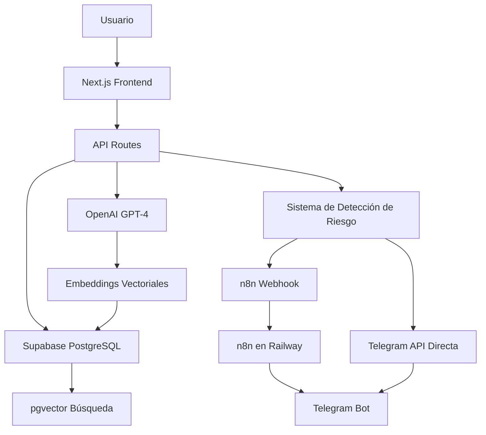

# 💜 Break_IA - Aplicación Cristiana de Bienestar Emocional

[](https://nextjs.org/)
[](https://www.typescriptlang.org/)
[](https://supabase.com/)
[](https://openai.com/)
[](https://vercel.com/)

## 🌟 Descripción del Proyecto

**Break_IA** es una aplicación web cristiana innovadora diseñada para ayudar a las personas con su bienestar emocional y psicológico mediante tecnología de vanguardia y fundamentos bíblicos sólidos.

### 🎯 Características Principales

- 📖 **Versículos Bíblicos Personalizados** - Sistema RAG con búsqueda semántica basada en emociones
- 🤖 **Chat con IA Cristiana** - Consejería basada en las Escrituras usando GPT-4
- 📊 **Tests Emocionales Diarios** - Evaluación y seguimiento del bienestar mental
- 🚨 **Sistema de Detección de Riesgo** - Alertas automáticas para crisis emocionales
- 📱 **Bot de Telegram** - Notificaciones y versículos diarios
- ⚡ **Automatización con n8n** - Workflows inteligentes para alertas
- 🔍 **Búsqueda Vectorial** - Embeddings de OpenAI para recomendaciones precisas

### 🏆 Objetivo Académico

Este proyecto fue desarrollado como trabajo final para demostrar la integración de múltiples tecnologías modernas:

1. **Frontend Moderno** - Next.js 14 + TypeScript + Tailwind CSS
2. **Base de Datos Vectorial** - Supabase PostgreSQL + pgvector
3. **Inteligencia Artificial** - OpenAI GPT-4 + Embeddings
4. **Automatización** - n8n workflows en Railway
5. **Mensajería** - Telegram Bot API

## 🚀 Demo en Vivo

**🌐 Aplicación Web:** [https://proyecto-difinitivo-f.vercel.app](https://proyecto-difinitivo-f.vercel.app)

**🤖 n8n Workflows:** [https://primary-production-7b95.up.railway.app](https://primary-production-7b95.up.railway.app)

### 👥 Usuarios de Prueba

- **Email:** `juan.perez@example.com` | **Contraseña:** `123456`
- **Email:** `maria.garcia@example.com` | **Contraseña:** `123456`

## 🛠️ Stack Tecnológico

### Frontend
- **Next.js 14** - React framework con App Router
- **TypeScript** - Tipado estático
- **Tailwind CSS** - Utility-first CSS framework
- **Lucide React** - Iconografía moderna

### Backend
- **Next.js API Routes** - Serverless functions
- **Supabase** - PostgreSQL + Real-time + Auth
- **pgvector** - Extensión para búsqueda vectorial

### Inteligencia Artificial
- **OpenAI GPT-4** - Modelo de lenguaje para chat cristiano
- **text-embedding-ada-002** - Embeddings para búsqueda semántica
- **Sistema RAG** - Retrieval Augmented Generation

### Automatización
- **n8n** - Workflow automation platform
- **Railway** - Hosting para n8n
- **Webhooks** - Comunicación entre servicios

### Mensajería
- **Telegram Bot API** - Notificaciones y alertas
- **Dual Alert System** - n8n + Direct API calls

### Despliegue
- **Vercel** - Hosting principal de la aplicación
- **Railway** - Hosting de n8n workflows
- **GitHub** - Control de versiones

## 🏗️ Arquitectura del Sistema



## 📂 Estructura del Proyecto

```
break-ia/
├── 📁 src/
│   ├── 📁 app/                    # Next.js 14 App Router
│   │   ├── 📁 api/               # API Routes serverless
│   │   │   ├── chat/             # Chat con IA cristiana
│   │   │   ├── tests/            # Tests emocionales
│   │   │   ├── verses/           # Versículos bíblicos
│   │   │   ├── telegram/         # Bot de Telegram
│   │   │   └── webhook/          # Webhooks n8n
│   │   ├── 📁 chat/              # Página de chat
│   │   ├── 📁 dashboard/         # Dashboard principal
│   │   ├── 📁 test/              # Test emocional
│   │   ├── 📁 verses/            # Explorador de versículos
│   │   └── 📁 login/             # Autenticación
│   ├── 📁 components/            # Componentes React
│   ├── 📁 lib/                   # Utilidades y configuración
│   │   ├── supabase.ts           # Cliente Supabase
│   │   ├── openai-christian.ts   # IA cristiana
│   │   ├── risk-detection.ts     # Detección de riesgo
│   │   ├── embeddings.ts         # Generación de embeddings
│   │   └── telegram.ts           # Bot de Telegram
│   └── 📁 types/                 # Tipos TypeScript
├── 📁 scripts/                   # Scripts de utilidad
├── 📁 docs/                      # Documentación
├── 📁 supabase/                  # Configuración BD
├── 🗄️ SQL_COMPLETO_SUPABASE.sql # Schema completo
├── 🔧 n8n-workflow-*.json       # Workflows de n8n
└── 📋 mcp-config.json           # Configuración MCP
```

## 🚀 Instalación y Configuración

### 1. Prerrequisitos

```bash
# Node.js 18+ y npm
node --version  # v18.0.0+
npm --version   # 9.0.0+

# Git
git --version
```

### 2. Clonar el Repositorio

```bash
git clone https://github.com/Aaronndg/PROYECTO_DIFINITIVO_F.git
cd PROYECTO_DIFINITIVO_F/break-ia
```

### 3. Instalar Dependencias

```bash
npm install
```

### 4. Configurar Variables de Entorno

Crear archivo `.env.local`:

```env
# Supabase Configuration
NEXT_PUBLIC_SUPABASE_URL=tu_supabase_url
NEXT_PUBLIC_SUPABASE_ANON_KEY=tu_supabase_anon_key
SUPABASE_SERVICE_ROLE_KEY=tu_supabase_service_role_key

# OpenAI Configuration
OPENAI_API_KEY=tu_openai_api_key

# Telegram Bot Configuration
TELEGRAM_BOT_TOKEN=tu_telegram_bot_token
TELEGRAM_CHAT_ID=tu_telegram_chat_id

# n8n Webhook Configuration
N8N_WEBHOOK_URL=tu_n8n_webhook_url
```

### 5. Configurar Base de Datos

1. Crear proyecto en [Supabase](https://supabase.com)
2. Ejecutar el script SQL completo:

```bash
# Copiar contenido de SQL_COMPLETO_SUPABASE.sql
# Pegarlo en Supabase SQL Editor
# Ejecutar el script
```

### 6. Generar Embeddings

```bash
# Generar embeddings para versículos bíblicos
npm run generate-embeddings
```

### 7. Ejecutar en Desarrollo

```bash
npm run dev
```

La aplicación estará disponible en `http://localhost:3000`

## 🤖 Configuración de n8n

### 1. Desplegar n8n en Railway

1. Crear cuenta en [Railway](https://railway.app)
2. Importar el workflow `n8n-workflow-break-ia-alerts.json`
3. Configurar variables de entorno en Railway
4. Obtener URL del webhook

### 2. Configurar Telegram Bot

```bash
# Crear bot con @BotFather en Telegram
# Obtener token del bot
# Configurar webhook en n8n
```

### 3. Probar Alertas

```bash
# Ejecutar script de prueba
node scripts/test-n8n-alert.js
```

## 📊 Base de Datos

### Esquema Principal

```sql
-- Tabla de versículos con vectores
biblical_verses (
    id UUID PRIMARY KEY,
    reference VARCHAR(100),
    text_rv60 TEXT,
    text_ntv TEXT,
    emotion_tags TEXT[],
    embedding VECTOR(1536),
    metadata JSONB
)

-- Tabla de tests emocionales
emotional_tests (
    id UUID PRIMARY KEY,
    user_id TEXT,
    mood_score INTEGER,
    anxiety_level INTEGER,
    stress_level INTEGER,
    energy_level INTEGER,
    sleep_quality INTEGER,
    notes TEXT,
    predominant_emotion TEXT,
    recommendations TEXT
)

-- Tabla de sesiones de chat
chat_sessions (
    id UUID PRIMARY KEY,
    user_id TEXT,
    title TEXT,
    emotion_context TEXT
)

-- Tabla de mensajes
chat_messages (
    id UUID PRIMARY KEY,
    session_id UUID,
    content TEXT,
    is_user BOOLEAN,
    emotion_analysis JSONB,
    risk_level INTEGER
)
```

## 🔍 Características Técnicas Detalladas

### Sistema RAG (Retrieval Augmented Generation)

```typescript
// Búsqueda semántica de versículos
const searchVerses = async (emotion: string) => {
  // 1. Generar embedding de la emoción
  const embedding = await openai.embeddings.create({
    model: "text-embedding-ada-002",
    input: emotion
  })
  
  // 2. Búsqueda vectorial en Supabase
  const { data } = await supabase.rpc('match_verses', {
    query_embedding: embedding.data[0].embedding,
    match_threshold: 0.8,
    match_count: 3
  })
  
  return data
}
```

### Detección de Riesgo

```typescript
// Sistema de detección de crisis emocionales
const riskKeywords = [
  'suicidio', 'matarme', 'no quiero vivir',
  'acabar con todo', 'morir', 'autolesión'
]

const assessRisk = (message: string): number => {
  let riskScore = 0
  // Algoritmo de puntuación de riesgo
  // Activa alertas duales: n8n + Telegram directo
}
```

### Chat con IA Cristiana

```typescript
// Sistema de chat fundamentado en las Escrituras
const christianAI = {
  async getCounselingResponse(message: string, emotion: string) {
    const verses = await searchVerses(emotion)
    const systemPrompt = `
      Eres un consejero cristiano fundamentado en las Escrituras.
      Proporciona orientación basada en principios bíblicos.
      Versículos relevantes: ${verses.map(v => v.text_rv60).join('\n')}
    `
    // Genera respuesta con GPT-4
  }
}
```

## 🚨 Sistema de Alertas

### Flujo de Detección

1. **Usuario envía mensaje** → API de chat
2. **Análisis de riesgo** → Algoritmo de puntuación
3. **Si riesgo alto** → Dispara alertas duales:
   - Webhook a n8n en Railway
   - Llamada directa a Telegram API
4. **n8n procesa** → Envía alerta estructurada
5. **Telegram API** → Notificación inmediata

### Configuración de Webhooks

```javascript
// Webhook n8n para alertas
const sendAlert = async (riskData) => {
  await fetch(process.env.N8N_WEBHOOK_URL, {
    method: 'POST',
    headers: { 'Content-Type': 'application/json' },
    body: JSON.stringify({
      type: 'risk_alert',
      user: riskData.user,
      message: riskData.message,
      riskLevel: riskData.score,
      timestamp: new Date().toISOString()
    })
  })
}
```

## 📱 API Endpoints

### Chat Cristiano
```
POST /api/chat
{
  "message": "Me siento muy triste",
  "userId": "user@example.com",
  "sessionId": "uuid"
}
```

### Tests Emocionales
```
POST /api/tests
{
  "userId": "user@example.com",
  "moodScore": 6,
  "anxietyLevel": 4,
  "stressLevel": 3,
  "energyLevel": 7,
  "sleepQuality": 8,
  "notes": "Me siento bien hoy"
}
```

### Versículos por Emoción
```
GET /api/verses?emotion=tristeza&limit=5
```

### Telegram Webhook
```
POST /api/telegram
{
  "message": {
    "text": "/versiculo",
    "from": { "id": 123456789 }
  }
}
```

## 🧪 Testing

### Scripts de Prueba Incluidos

```bash
# Probar conexión a Supabase
node scripts/test-supabase-connection.js

# Probar generación de embeddings
node scripts/embeddings-simple.js

# Probar detección de riesgo
node scripts/test-risk-detection.js

# Probar alertas de n8n
node scripts/test-n8n-alert.js

# Probar bot de Telegram
node scripts/test-telegram-bot.js

# Verificar API en Vercel
node scripts/test-vercel-test-api.js
```

### Casos de Prueba

1. **Test Emocional Completo** - 6 pasos de evaluación
2. **Chat con Detección de Riesgo** - Palabras clave activando alertas
3. **Búsqueda Semántica** - Versículos por emoción
4. **Alertas Duales** - n8n + Telegram directo
5. **Bot de Telegram** - Comandos y respuestas

## 🔒 Seguridad

### Medidas Implementadas

- **Row Level Security** en Supabase
- **Rate Limiting** en API routes
- **Input Sanitization** para prevenir XSS
- **Environment Variables** para secrets
- **HTTPS** en todos los endpoints
- **Webhook Validation** para n8n

### Políticas de Privacidad

- Los datos emocionales son privados por usuario
- Mensajes de chat con retención limitada
- Alertas de riesgo solo para casos críticos
- Cumplimiento con principios de privacidad

## 📈 Métricas y Monitoreo

### Dashboard Incluido

- **Tests Emocionales** - Progreso y tendencias
- **Sesiones de Chat** - Historial y análisis
- **Alertas Activadas** - Log de casos de riesgo
- **Versículos Recomendados** - Estadísticas de uso

### Logging

```typescript
// Sistema de logs para debugging
console.log('Risk detected:', {
  user: userId,
  riskScore: score,
  keywords: detectedKeywords,
  timestamp: new Date().toISOString()
})
```

## 🤝 Contribución

### Estructura para Colaboradores

1. Fork del repositorio
2. Crear rama feature: `git checkout -b feature/nueva-caracteristica`
3. Commit changes: `git commit -m 'Add nueva caracteristica'`
4. Push to branch: `git push origin feature/nueva-caracteristica`
5. Crear Pull Request

### Estándares de Código

- **TypeScript** strict mode
- **ESLint** + **Prettier** configurados
- **Conventional Commits** para mensajes
- **Tests** para nuevas características

## 📚 Documentación Adicional

### Archivos de Referencia

- `docs/PROYECTO_FINAL_RESUMEN.md` - Resumen ejecutivo
- `docs/RAG_SYSTEM.md` - Documentación del sistema RAG
- `N8N_SETUP_GUIDE.md` - Guía de configuración n8n
- `N8N_TELEGRAM_SETUP.md` - Setup del bot de Telegram
- `RAILWAY_N8N_CONFIG.md` - Despliegue en Railway
- `SETUP_DATABASE.md` - Configuración de base de datos

### Recursos Bíblicos

- **20 versículos cargados** con embeddings
- **Reina Valera 60** y **Nueva Traducción Viviente**
- **Categorización por emociones:** tristeza, ansiedad, esperanza, paz, etc.

## 🏆 Logros Técnicos

### Innovaciones Implementadas

✅ **Sistema RAG Completo** - Búsqueda semántica de versículos bíblicos
✅ **Detección de Crisis** - Algoritmo de riesgo con alertas automáticas  
✅ **IA Cristiana** - GPT-4 fundamentado en las Escrituras
✅ **Alertas Duales** - n8n workflows + Telegram API directo
✅ **Base Vectorial** - pgvector con OpenAI embeddings
✅ **Automatización Completa** - n8n en Railway para workflows
✅ **Aplicación Full-Stack** - Next.js 14 + TypeScript + Supabase
✅ **Despliegue Productivo** - Vercel con todas las características

### Métricas del Proyecto

- **7 tablas** en base de datos PostgreSQL
- **20 versículos** con embeddings vectoriales
- **6 API endpoints** completamente funcionales
- **4 páginas principales** con UI/UX completa
- **20+ palabras clave** para detección de riesgo
- **2 sistemas de alerta** funcionando en paralelo
- **3 plataformas** de despliegue (Vercel + Railway + Supabase)

## 🎓 Valor Académico

### Tecnologías Demostradas

1. **Frontend Moderno** - Next.js 14, TypeScript, Tailwind CSS
2. **Base de Datos Avanzada** - PostgreSQL, pgvector, búsqueda semántica
3. **Inteligencia Artificial** - OpenAI GPT-4, embeddings, sistema RAG
4. **Automatización** - n8n workflows, webhooks, Railway deployment
5. **Comunicación** - Telegram Bot API, alertas en tiempo real

### Aplicación Real

- **Sistema de Crisis** que puede salvar vidas
- **Plataforma de Bienestar** con base bíblica sólida
- **Tecnología de Vanguardia** aplicada a necesidades reales
- **Escalabilidad** demostrada con arquitectura profesional

## 📞 Contacto y Soporte

**Desarrollador:** Aaron Daniel González  
**Proyecto:** Break_IA - Aplicación Cristiana de Bienestar Emocional  
**Universidad:** [Tu Universidad]  
**Curso:** Desarrollo Web  
**Año:** 2025  

### Enlaces Importantes

- 🌐 **App Principal:** [https://proyecto-difinitivo-f.vercel.app](https://proyecto-difinitivo-f.vercel.app)
- 🤖 **n8n Workflows:** [https://primary-production-7b95.up.railway.app](https://primary-production-7b95.up.railway.app)
- 📊 **Supabase Dashboard:** [Configuración privada]
- 🔧 **Repository:** [https://github.com/Aaronndg/PROYECTO_DIFINITIVO_F](https://github.com/Aaronndg/PROYECTO_DIFINITIVO_F)

---

### ⭐ ¿Te gusta el proyecto?

Si este proyecto te ha sido útil o interesante, considera darle una estrella ⭐ en GitHub y compartirlo con otros que puedan beneficiarse de una aplicación de bienestar emocional con fundamentos cristianos.

**"Y el Dios de esperanza os llene de todo gozo y paz en el creer, para que abundéis en esperanza por el poder del Espíritu Santo."** - Romanos 15:13

---

*Desarrollado con 💜 para el bienestar emocional y espiritual de las personas, combinando tecnología moderna con la sabiduría eterna de las Escrituras.*
